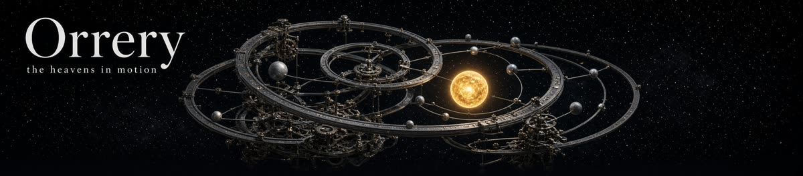
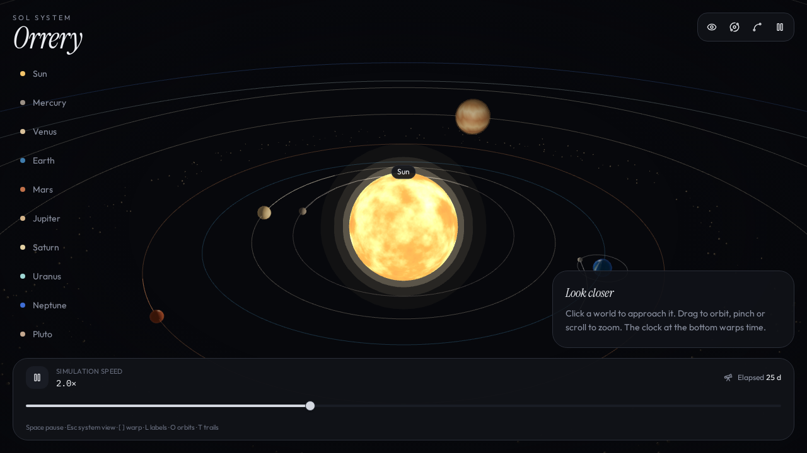
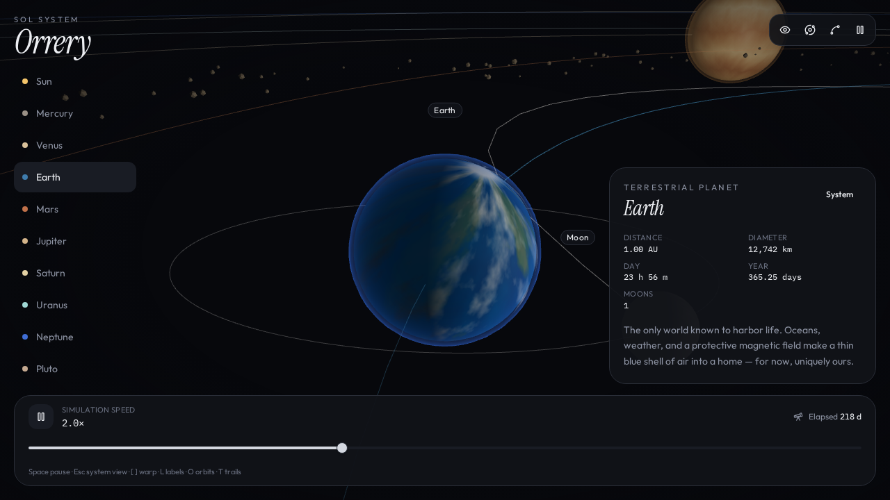
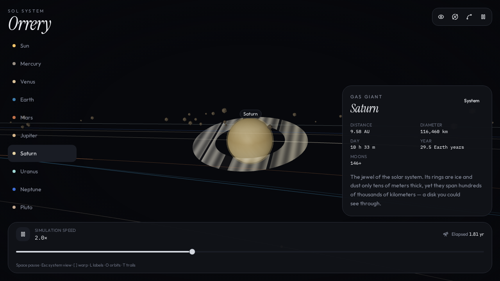

<p align="center">
  
</p>

# 🌌 Sol System Orrery (Better Call Sol)

<p align="center">
  <strong>A living, interactive 3D model of our Solar System in the browser.</strong>
  <br />
  <em>Orbiting worlds, procedural planetary shaders, cinematic camera tracking, and a warpable simulation clock.</em>
</p>

<p align="center">
  <a href="#-features"></a>
  <a href="#-features"></a>
  <a href="#-features"></a>
  <a href="#-features"></a>
  <a href="#-features"></a>
  <a href="#-features"></a>
  <a href="#-features"></a>
</p>

---

## 📸 Showcase

<p align="center">
  
</p>

<p align="center">
  <em>Global system view showing planetary orbits, instanced asteroid belt, sun corona, and glassmorphic control dock.</em>
</p>

<br />

<p align="center">
  
  
</p>

<p align="center">
  <em>Left: Earth with atmospheric Fresnel limb glow and orbiting Moon. Right: Saturn featuring procedural concentric rings and telemetry facts card.</em>
</p>

---

## ✨ Features

### 🪐 Astronomically Inspired Orrery Mechanics

- **Complete Planetary System**: High-fidelity celestial modeling of the Sun, Mercury, Venus, Earth + Moon, Mars, Jupiter, Saturn + rings, Uranus, Neptune, and Pluto.
- **Keplerian Orbital Motion**: Scaled orbital radii, accurate orbital periods, true anomaly phase offsets, axial inclinations, and retrograde rotation support (Venus, Uranus).
- **Instanced 3D Asteroid Belt**: 280+ procedural tumbling asteroids with customized instanced matrices and randomized rotation speeds orbiting between Mars and Jupiter.
- **Dynamic Motion Trails**: Real-time fading trajectory splines tracing celestial paths through 3D space.

### 🎨 Custom GLSL Shaders & Procedural Texturing

- **Turbulent Solar Plasma Shader**: Custom GLSL vertex and fragment shaders utilizing multi-octave Fractional Brownian Motion (`fbm`) noise for real-time solar flare convection and corona illumination.
- **Atmospheric Scattering (Fresnel Glow)**: Custom limb-darkening shader simulating Rayleigh/Mie atmospheric scatter on planets with atmospheres (Earth, Venus, Jupiter, Saturn, Uranus, Neptune, Titan).
- **Procedural Canvas Textures**: 2D seamless cylindrical noise sampling generating planet surface reliefs, cloud decks, storm bands, and Saturn's rings with zero heavy static texture assets.
- **Immersive Deep-Space Environment**: 5,500 twinkling background stars with customized distance, depth attenuation, and subtle parallax.

### 🎥 Cinematic Camera Rig

- **Smooth Planetary Navigation**: Seamless spring-damped lerp transitions between global system perspective and focused planetary orbits.
- **Intelligent Framing**: Camera automatically calculates optimal viewing distance based on world scale and ring dimensions.
- **360° OrbitControls**: Smooth pan, tilt, scroll-wheel zoom, and touch gesture support.

### 🎛️ Glassmorphism Telemetry HUD

- **Time Warp Control**: Logarithmic simulation speed slider ranging from **0.25×** to **64×** realtime with instantaneous pause/resume.
- **Elapsed Simulation Clock**: Live counter tracking elapsed astronomical time in days and Earth years.
- **Deep-Space Catalog**: Slide-out planet drawer containing astronomical telemetry: classification, distance from Sun (AU), diameter, day length, year duration, moon counts, and astronomical lore.
- **Visual Overlays**: Instant toggles for planetary labels (`L`), orbital rings (`O`), and motion trails (`T`).

---

## ⌨️ Keyboard Shortcuts

|             Key             | Action             | Description                                                                                |
| :-------------------------: | :----------------- | :----------------------------------------------------------------------------------------- |
|      <kbd>Space</kbd>       | **Pause / Resume** | Freezes or unfreezes celestial motion in real time                                         |
|       <kbd>Esc</kbd>        | **System View**    | Resets camera to bird's-eye solar overview                                                 |
| <kbd>[</kbd> / <kbd>]</kbd> | **Time Warp**      | Decreases or increases simulation speed multiplier                                         |
|        <kbd>L</kbd>         | **Toggle Labels**  | Shows or hides planetary name tags                                                         |
|        <kbd>O</kbd>         | **Toggle Orbits**  | Shows or hides orbital path ellipses                                                       |
|        <kbd>T</kbd>         | **Toggle Trails**  | Shows or hides planetary motion trail splines                                              |
| <kbd>1</kbd> – <kbd>9</kbd> | **Quick Focus**    | Instantly approaches Sun, Mercury, Venus, Earth, Mars, Jupiter, Saturn, Uranus, or Neptune |

---

## 🗺️ Celestial Catalog

| Body           | Classification | Distance (AU) |   Diameter   | Day Length | Year Length | Satellites |
| :------------- | :------------- | :-----------: | :----------: | :--------: | :---------: | :--------: |
| ☀️ **Sun**     | G-type Star    |       —       | 1,391,000 km | 25.4 days  |      —      |     —      |
| 🪨 **Mercury** | Terrestrial    |    0.39 AU    |   4,879 km   |  176 days  |   88 days   |     0      |
| 🌫️ **Venus**   | Terrestrial    |    0.72 AU    |  12,104 km   |  243 days  |  225 days   |     0      |
| 🌍 **Earth**   | Terrestrial    |    1.00 AU    |  12,742 km   |  23h 56m   | 365.25 days |  1 (Moon)  |
| 🔴 **Mars**    | Terrestrial    |    1.52 AU    |   6,779 km   |  24h 37m   |  687 days   |     2      |
| 🌪️ **Jupiter** | Gas Giant      |    5.20 AU    |  139,820 km  |   9h 56m   | 11.9 years  |    95+     |
| 🪐 **Saturn**  | Gas Giant      |    9.58 AU    |  116,460 km  |  10h 33m   | 29.5 years  |    146+    |
| 🧊 **Uranus**  | Ice Giant      |    19.2 AU    |  50,724 km   |  17h 14m   |  84 years   |     28     |
| 🔵 **Neptune** | Ice Giant      |    30.1 AU    |  49,244 km   |  16h 06m   |  165 years  |     16     |
| ❄️ **Pluto**   | Dwarf Planet   |    39.5 AU    |   2,377 km   |  6.4 days  |  248 years  |     5      |

---

## 🛠️ Tech Stack

- **Framework**: [React 19](https://react.dev/) + [TanStack Start](https://tanstack.com/start) / [TanStack Router](https://tanstack.com/router)
- **3D Graphics Engine**: [Three.js](https://threejs.org/) + [@react-three/fiber](https://docs.pmnd.rs/react-three-fiber) + [@react-three/drei](https://github.com/pmndrs/drei)
- **Styling & UI**: [Tailwind CSS v4](https://tailwindcss.com/) + [Radix UI](https://www.radix-ui.com/) + [Lucide Icons](https://lucide.dev/)
- **State Management**: [Zustand](https://github.com/pmndrs/zustand)
- **Bundler & Server**: [Vite 8](https://vite.dev/) + [Nitro](https://nitro.unjs.io/) (Vercel deployment target)
- **Language**: [TypeScript 5.7](https://www.typescriptlang.org/)

---

## 📂 Project Structure

```text
├── public/                 # Static assets, icons, OpenGraph images & banners
├── screenshots/            # Showcase screenshots for documentation
├── src/
│   ├── components/
│   │   ├── solar/
│   │   │   ├── camera-rig.tsx   # Cinematic spring camera & tracking
│   │   │   ├── canvas-root.tsx  # Three.js Canvas mounting point
│   │   │   ├── hud.tsx          # Glassmorphism telemetry UI, dock & hotkeys
│   │   │   ├── solar-app.tsx    # Orrery application container
│   │   │   └── system.tsx       # 3D scene: Sun, planets, shaders, asteroids
│   │   └── ui/                  # Accessible Radix & Tailwind UI primitives
│   ├── lib/
│   │   └── solar/
│   │       ├── bodies.ts        # Astronomical metrics, orbital physics data
│   │       ├── registry.ts      # Object references for camera targets
│   │       ├── store.ts         # Zustand simulation store & clock
│   │       └── textures.ts      # Real-time procedural canvas texture generators
│   ├── routes/                  # TanStack Router route trees & SSR root
│   ├── styles.css               # Design system tokens, typography & Tailwind
│   └── router.tsx               # Client router setup
├── package.json
├── tsconfig.json
└── vite.config.ts
```

---

## 🚀 Getting Started

### Prerequisites

- **Node.js** `>= 20.0.0`
- **npm**, **pnpm**, or **yarn**

### Installation

1. **Clone the repository**:

   ```bash
   git clone https://github.com/Icarus-conf/sol.git
   cd sol
   ```

2. **Install dependencies**:

   ```bash
   npm install
   ```

3. **Start the local development server**:

   ```bash
   npm run dev
   ```

4. **Open in browser**:
   Navigate to [`http://localhost:8080`](http://localhost:8080) to explore the solar system.

---

## 📜 Available Scripts

| Command             | Description                                                 |
| :------------------ | :---------------------------------------------------------- |
| `npm run dev`       | Starts the Vite development server on `http://0.0.0.0:8080` |
| `npm run build`     | Builds the production bundle with Nitro server output       |
| `npm run preview`   | Previews the production build locally                       |
| `npm run typecheck` | Runs TypeScript static type checking without emitting files |
| `npm run lint`      | Runs ESLint analysis across the repository                  |
| `npm run format`    | Formats all code files with Prettier                        |

---

## 🚢 Deployment

The application is configured with Nitro's Vercel preset out of the box in `vite.config.ts`:

```bash
npm run build
```

The resulting build is ready for zero-config deployment to [Vercel](https://vercel.com/) or any Node/Nitro compatible host.

---

## 📄 License

This project is licensed under the [MIT License](LICENSE) — see the LICENSE file for details.

<p align="center">
  <sub>Built with curiosity and wonder for the cosmos 🚀</sub>
</p>
